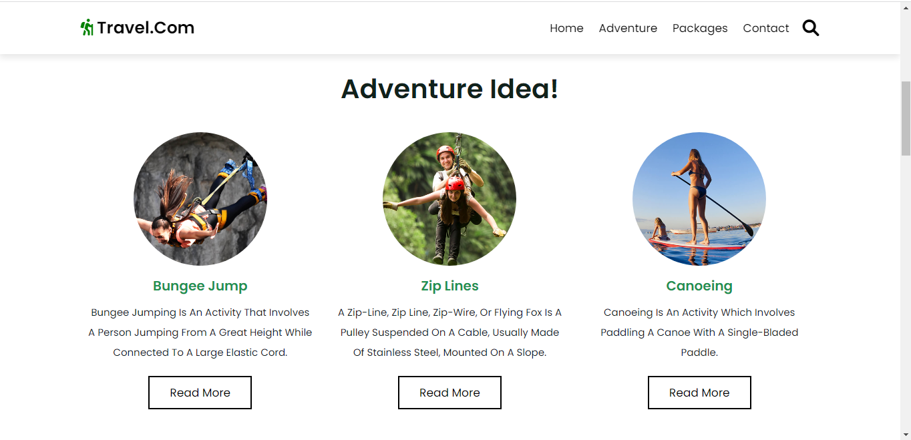
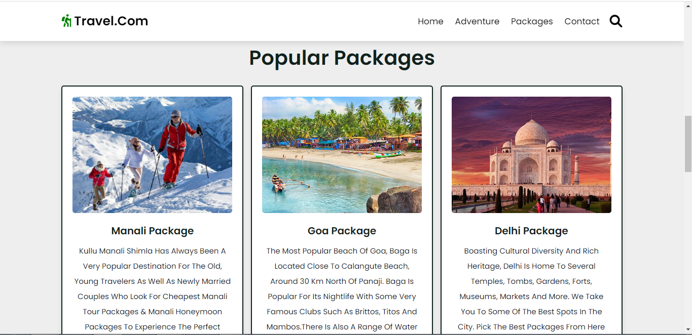
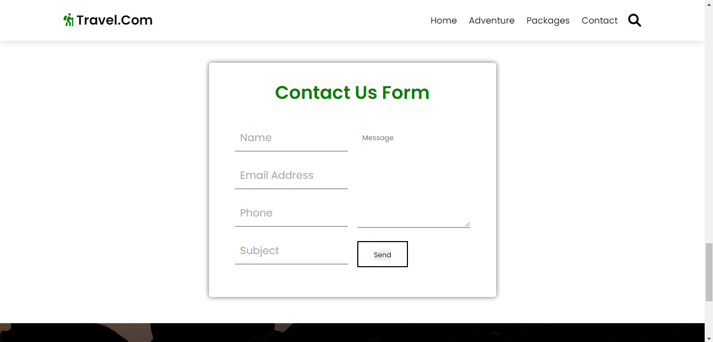

# Travel Planner Template

A beautiful, responsive travel planning website template built with HTML, CSS, and JavaScript.

## 🌟 Features

- **Responsive Design**: Works seamlessly on desktop, tablet, and mobile devices
- **Adventure Ideas**: Showcase exciting activities like bungee jumping, zip lines, and canoeing
- **Travel Packages**: Display popular destination packages with pricing
- **Contact Form**: Google Forms integration for user inquiries
- **Career Pages**: Local guide and taxi driver registration forms
- **Modern UI**: Clean, professional design with smooth animations

## 🚀 Quick Start

### View Locally

Simply open `index.html` in your web browser to view the template.

### Deploy to Vercel

1. **Install Vercel CLI** (if not already installed):
   ```bash
   npm install -g vercel
   ```

2. **Deploy**:
   ```bash
   cd /path/to/mini-project_TravelPlanner
   vercel
   ```

3. **Follow the prompts**:
   - Login to your Vercel account
   - Link to existing project or create new one
   - Accept default settings
   - Your site will be live in seconds!

### Alternative: Deploy via Vercel Dashboard

1. Go to [vercel.com](https://vercel.com)
2. Click "Add New Project"
3. Import your Git repository or upload the project folder
4. Click "Deploy"

## 📁 Project Structure

```
├── index.html              # Main homepage
├── loginandsignup.html     # Login/Signup page
├── ourServices.html        # Career opportunities page
├── localguide.html         # Local guide registration
├── taxi-driver.html        # Taxi driver registration
├── user.html              # Trip planning form
├── css/                   # Stylesheets
│   ├── style.css
│   ├── loginandsignup.css
│   ├── ourServices.css
│   ├── localguide.css
│   ├── traveldriver.css
│   └── userinput.css
├── js/                    # JavaScript files
│   ├── script.js
│   └── loginandsignup.js
├── images/                # Image assets
└── vercel.json           # Vercel configuration

```

## 🎨 Customization

### Update Content
- Edit HTML files to change text, images, and links
- Modify package information in `index.html`
- Update contact information in the footer

### Styling
- All CSS files are in the `css/` directory
- Main styles: `css/style.css`
- Page-specific styles in respective CSS files

### Images
- Replace images in the `images/` directory
- Update image references in HTML files

## 📝 Notes

- **Static Template**: This is a frontend-only template with no backend functionality
- **Forms**: Registration forms don't submit data (backend removed for static deployment)
- **Backend Files**: Files like `server.js`, `app.js`, and `models/` are not used in production

## 📸 Screenshots






## 📄 License

All rights reserved.

## 🤝 Contributors

Created for Mini-project - Travel Planner

---

**Deployed on Vercel** ▲
